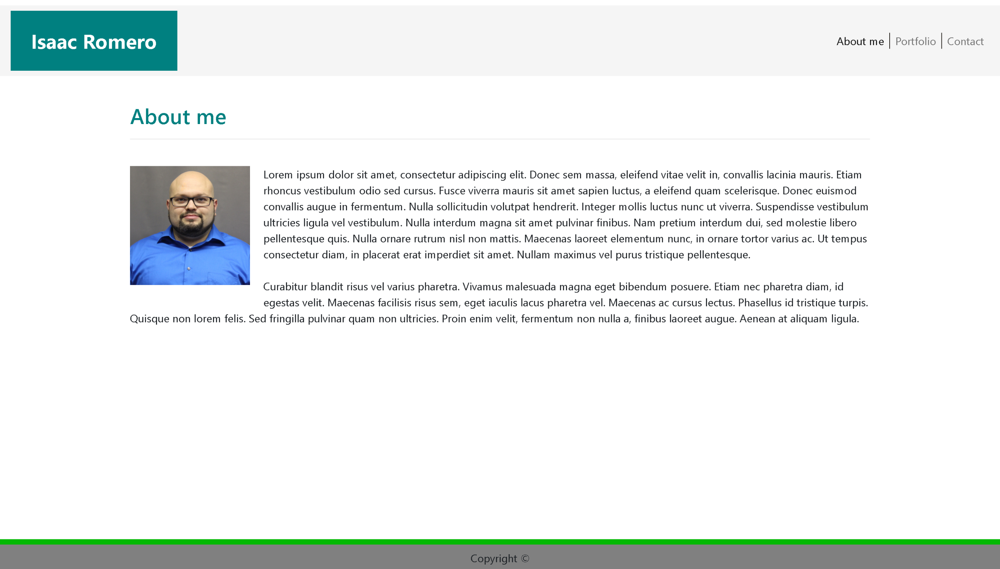
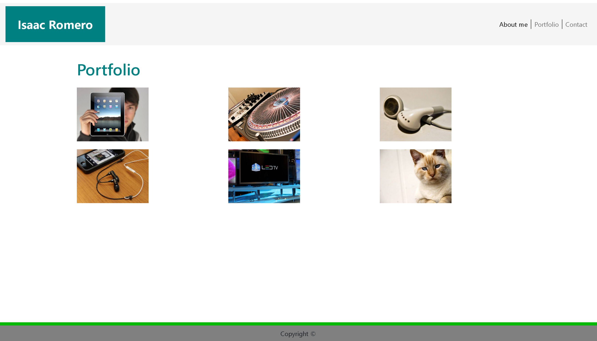
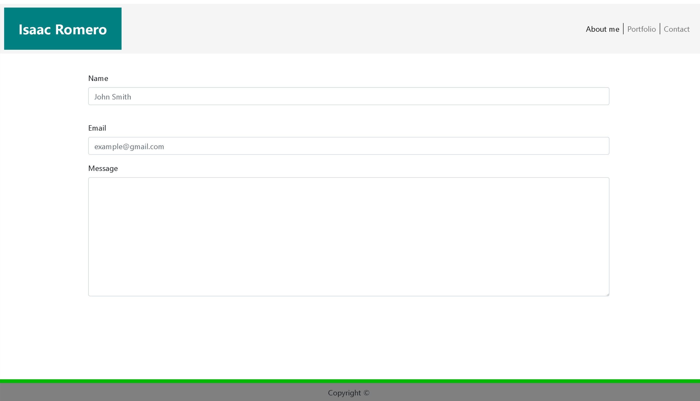

# Bootstrap-Portfolio

## Instructions

This is a remake of the basic portfolio. However, we used bootstrap to make the framework. The navbar and footer are both fixed to top and bottom. 

## Tech Use

Utilize bootsrapt grid to build framework. We also used bootstrap css classed to fixed color, styling and positiong. We did, however, used some non-bootstrap colors. We decided to use inline styling. 

## Future Developement

No future development plans. 

## Examples: 

